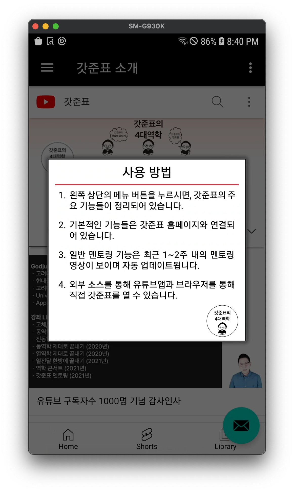

#### 이 어플은 구글 플레이스토어에서 다운받을 수 없습니다.

# 갓준표 for Android

## 들어가며
이 어플은 갓준표 커뮤니티 사용자들의 편리성을 위해서 제작되었습니다.
해당 어플은 1인 개발 형태로 제작되었으며 어떠한 상업적, 금전적 목적성을 띄지 않습니다(인앱 광고 포함하지 않음).
`갓준표 for Android`는 다음으 기능들을 지원하고 있습니다.
- 역학 콘서트 및 전공 질문 게시판 확인 기능
- 최근 멘토링 영상 다시보기 기능 (유튜브 영상 기반이므로 업데이트에 시간이 조금 걸릴 수 있습니다.)
- 국내 교수님들의 특별한 멘토링 영상 다시보기 기능
- 외부 앱(유튜브, 웹 브라우저)를 통해 갓준표 소스 열기 기능

## 이 어플의 목적
갓준표 사이트에 대한 접근성과 사용성이 사실상 매우 좋은 편에 속하지는 않습니다. 
보다 효율적으로 갓준표 사이트를 확인하고 활용하기 위해서 제작되었습니다. 
갓준표님으로부터 받은 멘토링과 갓준표님이 대학생들을 위해 불태우시는 노력에 보답하고자 해당 앱을 제작하였습니다.

## 다운로드 및 설치
 
갓준표 어플은 이 github에서만 다운로드 배포하고 있으며 타 사이트에서는 공식적으로 배포하지 않습니다. 
APK 파일 다운로드를 위해서는 Release Note를 참고해주시기 바랍니다. 
1. Release Note를 통해 최신 버전의 안드로이드용 갓준표 APK 파일을 다운로드 받는다.
	- `Releases > 최신 버전의 갓준표 > Assets > app-release.apk` 클릭
2. 다운로드 후 외부 앱에 대한 설치 권한을 허용해준다.
	- `설정 > 애플리케이션 > 더보기 메뉴 > 특별한 접근 > 출처를 알 수 없는 앱 설치` 활성화
	- 또는 `설정 > 애플리케이션 > 더보기 메뉴 > 특별한 접근 > 출처를 알 수 없는 앱 > 웹 브라우저 > 이 앱으로부터 허용` 활성화
3. 플레이 스토어에서 다운을 받는 앱이 아닌 외부에서 다운로드 및 설치를 하는 앱이므로 `플레이스토어`에 의해서 `Play 프로텍트` 알림이 뜰 수 있다. 보안을 위해 사용하는 소프트웨어이므로 무시하고 어플을 설치하면 된다.

## 사용 방법
사용 방법은 인앱에서 우측 상단의 `더보기 메뉴`를 클릭해 읽을 수 있다. 

## 제한 (한계)
- 개발자가 22.07.04부로 군입대를 하기 때문에, 2023년까지 대규모 업데이트는 없을 수 있으며 사소한 버그 수정이 전부일 수 있다.
- `Java SDK 수준 26`부터 지원이 된다(Android Version 8.0.0).

## License
	갓준표 for Android, including all git submodules are free software:
    you can redistribute it and/or modify it under the terms of the
    GNU General Public License as published by the Free Software Foundation,
    either version 3 of the License, or (at your option) any later version.

    This program is distributed in the hope that it will be useful,
    but WITHOUT ANY WARRANTY; without even the implied warranty of
    MERCHANTABILITY or FITNESS FOR A PARTICULAR PURPOSE.  See the
    GNU General Public License for more details.

    You should have received a copy of the GNU General Public License
    along with this program.  If not, see <http://www.gnu.org/licenses/>.